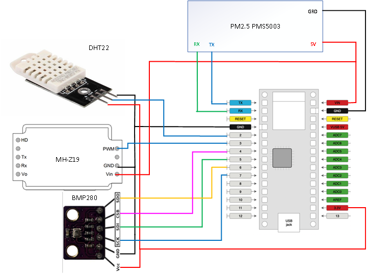
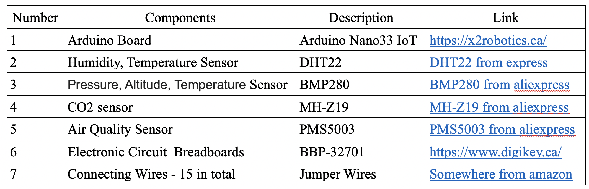
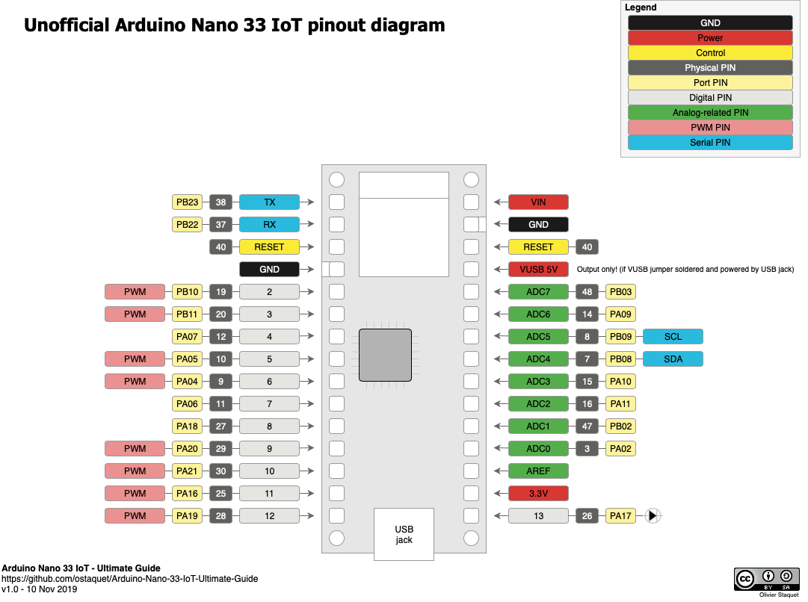

# There is a final code for my project.

### Brief Introduction.

 - The initial idea of this project was to make a WiFi-connected weather station which would display the information by the network connection via the browser. Some of the examples were found on the Internet and gave the idea of what to do. The initial plan was simple, display just the temperature with humidity and the Carbon Dioxide reading in the air, the information would be transmitted via the WiFi module to the network where it could be opened and checked via the browser. This is the point where the new and a current idea originated..

 - Since the initial WiFi sensor was too bulky, the plan to utilize more smaller components came in to play.  This is where I used Arduino Nano33 IoT as the base of the project. Due to a limited power pinout (3.3V and a Ground pin)  there was a need for connecting something what could hold more power connections than base. To maximize the pinout connections, I used Extendable Power Supply which is limited only to the Ground and Power (Power being either 3.3V connection or 5V connection, nothing else). The problem with a limited power pinout was solved in almost no time. Futhermore, now was the time to connect all of the sensors into the project, for this task I’ve used DHT22, BMP280, CO2 sensor and PM2.5 which I soon will brief about.

## [Full project description](/img/project_final.pdf)

## References
[The official Arduino Nano 33 IOT quick start guide](https://www.arduino.cc/en/Guide/NANO33IoT)

[Arduino Uno pinout](https://www.circuito.io/blog/arduino-uno-pinout/)

Arduino Programming Course Contents https://startingelectronics.org/software/arduino/learn-to-program-course

[Arduino Nano 33 IOT does not support Sofware.Serial](https://stackoverflow.com/questions/57175348/softwareserial-for-arduino-nano-33-iot)

https://github.com/ostaquet/Arduino-Nano-33-IoT-Ultimate-Guide

### CO2 requrement and regulation:
https://www.kane.co.uk/knowledge-centre/what-are-safe-levels-of-co-and-co2-in-rooms

https://www.osstf.on.ca/en-CA/services/health-safety/information-bulletins/inadequate-ventilation-and-high-co2-levels.aspx

### CO2 References:
https://habr.com/ru/post/391157/

https://www.2150692.ru/faq/87-co2-mhz19-arduino

### PM2.5 References:
[Real-time Air Quality Index](https://aqicn.org/city/toronto/)

https://learn.adafruit.com/pm25-air-quality-sensor/arduino-code

https://www.instructables.com/id/Make-one-PM25-monitor-with-Arduino-UNO/

https://how2electronics.com/interfacing-pms5003-air-quality-sensor-arduino/

https://wiki.dfrobot.com/PM2.5_laser_dust_sensor_SKU_SEN0177

### DHT22 References:
https://create.arduino.cc/projecthub/mafzal/temperature-monitoring-with-dht22-arduino-15b013

https://howtomechatronics.com/tutorials/arduino/dht11-dht22-sensors-temperature-and-humidity-tutorial-using-arduino/

https://circuitdigest.com/microcontroller-projects/arduino-nano-33-ble-sense-board-review-and-getting-started-guide

### BMP280 References:
https://learn.adafruit.com/adafruit-bmp280-barometric-pressure-plus-temperature-sensor-breakout/arduino-test

https://startingelectronics.org/tutorials/arduino/modules/pressure-sensor/

Pinout - https://startingelectronics.org/pinout/GY-BMP280-pressure-sensor-module/

### Got some ideas from:
https://create.arduino.cc/projecthub/projects/tags/fun?page=3

https://www.instructables.com/circuits/arduino/projects/?page=31

https://www.instructables.com/id/Make-Your-Own-Retro-Nixie-Clock-With-an-RTC/

https://www.instructables.com/id/SteamPunk-Radio/

https://www.instructables.com/id/DIY-Mini-CNC-Laser-Engraver/

https://www.instructables.com/id/Tide-and-Weather-Clock/

https://www.instructables.com/id/DIY-Radioactivity-Counter-IoT-and-Eco-system/

https://www.instructables.com/id/Art-Deco-FM-Radio-Project-Using-Arduino/

https://www.instructables.com/id/ESP32-E-Paper-Thermometer/

https://www.instructables.com/id/Get-Started-Building-a-PM-Monitoring-Station/

https://www.instructables.com/id/Smart-Switch-1/

https://www.instructables.com/id/ITTT-Arduino-Vulploeg-Timer/

https://www.instructables.com/id/Simple-IOT-Alarm/

https://www.hackster.io/eben-kouao/smart-mirror-touchscreen-with-face-recognition-6c84cc

https://rootsaid.com/arduino-home-safety-monitor/
